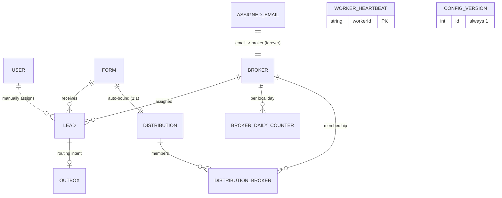

# Data Model: Lead Distribution Platform

**Feature**: 001-lead-distribution-platform | **Date**: 2026-08-25
**Source of truth for shapes**: `backend/prisma/schema.prisma` (to be written
in implementation); this document is the design contract it must satisfy.

## Entity Relationship Overview



## Entities

### User (administrator)
| Field | Type | Rules |
|---|---|---|
| id | Int, PK, autoincrement | |
| email | String, unique | ≤255; login identifier |
| passwordHash | String | bcrypt cost 12 — never logged, never returned |
| createdAt | DateTime | |

Exactly one seeded row (from env at seed time); no registration path.

### Form
| Field | Type | Rules |
|---|---|---|
| id | Int, PK | |
| name | String | 2–100 chars |
| slug | String, unique | `^[a-z0-9]+(?:-[a-z0-9]+)*$`, 2–50 chars, reserved words blocked (`api`, `login`, `dashboard`, `brokers`, `leads`, `form`, `distribution`, `ops`) |
| singleton | Boolean, **unique** | Invariant: exactly one row platform-wide |
| createdAt | DateTime | |

Immutable after creation; no delete. Any write bumps `ConfigVersion`.

### Distribution
| Field | Type | Rules |
|---|---|---|
| id | Int, PK | |
| name | String | 2–100 chars |
| formId | Int, FK → Form | Auto-bound to the one form at creation |
| timezone | String | Valid IANA zone; reference timezone for shared daily total; default `Asia/Manila` |
| singleton | Boolean, **unique** | Invariant: exactly one row platform-wide |
| createdAt / updatedAt | DateTime | |

Creation requires the form to exist (`FORM_REQUIRED` otherwise). Any write
(including member changes) bumps `ConfigVersion` in the same transaction.

### Broker
| Field | Type | Rules |
|---|---|---|
| id | Int, PK | Tie-break order uses ascending id |
| name | String | 2–100 chars |
| isActive | Boolean | Eligibility gate |
| dailyCap | Int | 0–10000; **0 = unlimited** |
| timezone | String | Valid IANA zone; governs working days, hours, cap day boundary |
| openingTime | String | `HH:MM` (00:00–23:59) |
| closingTime | String | `HH:MM`; may be ≤ openingTime → overnight window |
| workingDays | Int[] (JSON) | Non-empty, unique, values 1–7 (ISO week) |
| createdAt / updatedAt | DateTime | |

Delete refused while leads exist (409) — deactivate instead.

### DistributionBroker (membership)
| Field | Type | Rules |
|---|---|---|
| distributionId + brokerId | Composite unique | One membership per pair |
| percentage | Decimal(5,2) | 0–100; > 0 required for eligibility; sum MAY ≠ 100 (UI warns only) |
| isActiveInDistribution | Boolean | Eligibility gate distinct from broker.isActive |

### Lead
| Field | Type | Rules |
|---|---|---|
| id | Int, PK | |
| formId | Int, FK → Form | |
| name | String | 2–100 chars |
| email | String | Normalized (trim + lowercase) before storage and comparison; ≤255 |
| phone | String | 7–20 chars, allowed: digits `+ - ( )` space |
| ipAddress | String | **NOT NULL** on every lead regardless of status; loopback forms normalized to 127.0.0.1 |
| status | Enum: UNSENT, SENT, DUPLICATE, FAILED | See state machine below |
| brokerId | Int?, FK → Broker | Set iff SENT (or recorded on DUPLICATE as the prior assignee's broker in trace) |
| assignedAt | DateTime? | Broker-local-day semantics for caps; set on assignment |
| assignmentType | Enum: AUTO, MANUAL? | Set when SENT |
| failureReason | String? | Why UNSENT/FAILED persists |
| decisionTrace | Json | Exclusions by rule + winner arithmetic; excluded from ALL list queries |
| traceId | Char(32) hex | Correlation across processes; also indexed |
| createdAt | DateTime | Retention clock (purged after 90 days) |

Indexes: `[status, createdAt]` (list), `[brokerId, assignedAt]` (broker views,
cap counting), `[traceId]`. Purge policy: rows older than 90 days deleted in
bounded batches; NEVER cascades to AssignedEmail.

### AssignedEmail (duplicate guard)
| Field | Type | Rules |
|---|---|---|
| email | String, **PRIMARY KEY** | Normalized form; collision IS duplicate detection |
| brokerId | Int, FK → Broker | The one broker this email was ever sold to |
| leadId | Int, FK → Lead | Assignment provenance |
| assignedAt | DateTime | |

**Permanent** — never purged (FR-036). Written via insert-only claim; manual
assignment performs the identical claim.

### BrokerDailyCounter
| Field | Type | Rules |
|---|---|---|
| brokerId + localDate | Composite unique | localDate = calendar day in the BROKER's timezone |
| sentCount | Int | Incremented ONLY by conditional atomic update |
| capAtTime | Int | Cap snapshot used in the predicate |

Increment SQL (the entire cap-invariant):
```sql
UPDATE BrokerDailyCounter
   SET sentCount = sentCount + 1
 WHERE brokerId = ? AND localDate = ?
   AND (capAtTime = 0 OR sentCount < capAtTime);
-- affectedRows = 0 ⇒ slot lost ⇒ drop broker, re-select (max 3 attempts)
```

### Outbox (durable routing intent)
| Field | Type | Rules |
|---|---|---|
| id | Char(36) UUID, PK | Idempotency key |
| type | VarChar(64) | `LeadCaptured` \| `LeadRoutingRequested` |
| aggregateType / aggregateId | VarChar / VarChar | `'Lead'` / lead id |
| payload | Json | `{ leadId, formId, email }` |
| traceId | Char(32) | Carried from the visitor request into worker logs |
| status | Enum: PENDING, PROCESSING, DONE, DEAD | State machine below |
| attempts | Int | Dead after ≥ 5 |
| availableAt / claimedAt / processedAt | DateTime? | Backoff scheduling: 1s→4s→16s→64s→256s (+jitter) |
| lastError | Text? | Surfaced with DEAD for replay decisions |
| createdAt | DateTime | |

Indexes: `[status, availableAt]` (covering the claim query), `[aggregateType,
aggregateId]`, `[traceId]`. Claim: `SELECT … WHERE status='PENDING' AND
availableAt <= NOW() ORDER BY availableAt LIMIT 10 FOR UPDATE SKIP LOCKED`.
Stale `PROCESSING` rows (>5 min) reaped to `PENDING`. Retention: `DONE` purged
after 7 days; `DEAD` kept until replayed or manually handled.

### WorkerHeartbeat
| Field | Type | Rules |
|---|---|---|
| workerId | VarChar(64), PK | e.g. `worker-1` from env |
| lastBeatAt | DateTime | Readiness unhealthy if older than 60s |
| processedTotal | Int | Cumulative counter |
| version | VarChar(32) | Git short SHA at build |

### ConfigVersion
| Field | Type | Rules |
|---|---|---|
| id | Int, PK = 1 | Exactly one row, forever |
| version | Int | Bumped inside the same transaction as any config write |
| updatedAt | DateTime | |

## Invariants (Constitution Principle I map)

| # | Invariant | Mechanism | Holds if app code is wrong? |
|---|---|---|---|
| INV-1 | Exactly one Form | `singleton @unique` partial constraint | Yes |
| INV-2 | Exactly one Distribution | `singleton @unique` | Yes |
| INV-3 | Email assigned at most once ever | `AssignedEmail.email` PRIMARY KEY; insert collision = detection | Yes |
| INV-4 | Daily cap never exceeded | Conditional UPDATE predicate under row lock | Yes |
| INV-5 | No dual-write lead/message gap | Lead + Outbox in ONE transaction | Yes |
| INV-6 | Concurrent workers never share a message | `FOR UPDATE SKIP LOCKED` claim | Yes |
| INV-7 | Every lead has an IP | Column NOT NULL + edge capture normalization | Yes |

None of the values above are ever read through a cache (Principle V).

## State Machines

### Lead.status
```
            capture (tx: + Outbox row)
                │
                ▼
             UNSENT ──────────────► SENT (AUTO)      [worker: claim ok]
                │  │                    ▲
                │  │                    └── SENT (MANUAL) [admin assign]
                │  │
                │  ├──► DUPLICATE         [AssignedEmail insert collision;
                │  │                       no broker attributed]
                │  └──► FAILED            [processing error after retries;
                │                         retry action → re-enqueue]
                └─────► stays UNSENT      [NoEligibleBroker: reason +
                                          candidate count in trace;
                                          manual assign/retry paths apply]
```
Rules: SENT is terminal except manual re-assign is not offered (one sale
forever). DUPLICATE is terminal. FAILED/UNSENT are actionable (assign/retry).

### Outbox.status
```
PENDING ──claim──► PROCESSING ──success──► DONE (purged after 7d)
   ▲                   │
   │  backoff          ├─ failure (<5 attempts): PENDING, availableAt+=backoff
   └───────────────────┤
                       └─ attempts ≥ 5: DEAD ──admin replay──► PENDING
Stale PROCESSING (>5 min) ──reaper──► PENDING
```

## Day-Boundary Semantics

| Quantity | Timezone used | Notes |
|---|---|---|
| `totalSentToday` (shared deficit denominator) | **Distribution.timezone** | One commercial agreement over one pool needs one denominator (FR-015) |
| Broker working-day check | **Broker.timezone** | ISO weekday in broker-local calendar |
| Broker open/closed window | **Broker.timezone** | Minutes-since-midnight; `open ≥ close` wraps overnight |
| Broker cap reset (`localDate`) | **Broker.timezone** | Counter row keyed by broker-local date |
| Manual assignment timestamp display | **Broker.timezone** | `assignedAt` shown in target broker's zone |

## Validation Rules Summary (server-authoritative)

| Input | Rule |
|---|---|
| Lead name / broker name / form & distribution names | 2–100 characters |
| Email | RFC-shaped, ≤255; trimmed + lowercased pre-storage/comparison |
| Phone | 7–20 chars; digits and `+ - ( )` space only |
| dailyCap | Integer 0–10000; 0 = unlimited |
| Timezone | Must resolve to a valid IANA zone |
| Times | `^([01]\d|2[0-3]):([0-5]\d)$` |
| Working days | Non-empty array of unique integers 1–7 |
| Percentage | 0–100, up to 2 decimals |
| Slug | Regex + length + reserved-word list (FR-007) |
| Public submission | Honeypot empty; per-IP rate ≤ configurable default 30/min |

All validation returns field-level errors under `VALIDATION_ERROR` (422);
nothing partially persists.
